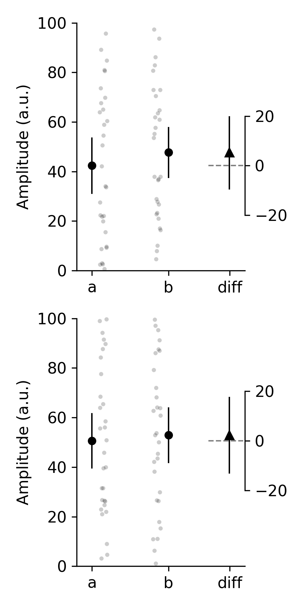
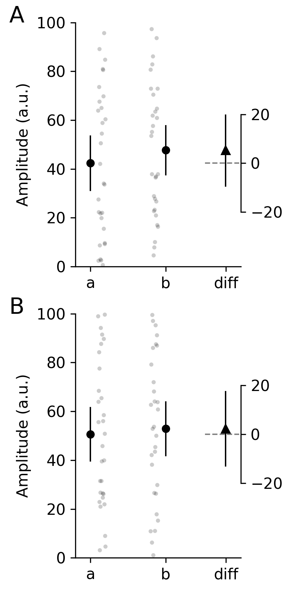

How To Guides
=============

Save figure
-----------
To save a **pliffy** plot, we have to specify a minimum of three things in `PliffyInfoABD`:

    - `figure_name`
    - `save`
    - `save_path`

For example:

.. code-block:: python

    >>> from pliffy import PliffyInfoABD, plot_abd
    >>> import random
    >>> random.seed(42)
    >>> data = [random.random() * 100 for _ in range(60)]
    >>> data_a = data[:30]
    >>> data_b = data[30:]
    >>> info = PliffyInfoABD(data_a=data_a,
                             data_b=data_b,
                             figure_name='great_figure',
                             save=True,
                             save_path='/home/martin/Desktop/'
                             )
    >>> plot_abd(info)

This will save our **pliffy** plot with the name `great_figure.png` to the specified folder. The plot is saved as a `png` at a `dpi=180` because these are the default values.

These can easily be changed:

.. code-block:: python

    >>> info = PliffyInfoABD(data_a=data_a,
                             data_b=data_b,
                             figure_name='great_figure',
                             save=True,
                             save_path='/home/martin/Desktop/',
                             dpi=300,
                             save_type='png',
                             )
    >>> plot_abd(info)

Alternatively, we may want to save our plot to a vector-based format, like `svg` or `pdf`. This too is possible with **pliffy**.

.. code-block:: python

    >>> info_pdf = PliffyInfoABD(data_a=data_a,
                              data_b=data_b,
                              figure_name='great_figure_pdf',
                              save=True,
                              save_path='/home/martin/Desktop/',
                              save_type='pdf',
                              )
    >>> plot_abd(info_pdf)
    >>> info_svg = PliffyInfoABD(data_a=data_a,
                              data_b=data_b,
                              figure_name='great_figure_svg',
                              save=True,
                              save_path='/home/martin/Desktop/',
                              save_type='svg',
                              )
    >>> plot_abd(info_svg)

Add pliffy plots as subplots to a figure
----------------------------------------
Thus far we have generated **pliffy** plots on their own. However, by passing a matplotlib axis object to the `plot_abd` function, we can create a **pliffy** plot on a pre-existing figure.

for example, this is useful if we want to create a pair of related **pliffy** plots, one on top of the other, for a one-column figure in the paper we are about to submit.

.. code-block:: python

    >>> from pliffy import PliffyInfoABD, plot_abd
    >>> import random
    >>> random.seed(42)
    # Generate random data for first subplot
    >>> data = [random.random() * 100 for _ in range(60)]
    >>> data_a = data[:30]
    >>> data_b = data[30:]
    # Create figure
    >>> fig, axes = plt.subplots(ncols=2, figsize=(3, 6))
    # Create info for first subplot, and plot (note show=False)
    >>> info1 = PliffyInfoABD(data_a=data_a, data_b=data_b,  show=False)
    >>> plot_abd(info1, axes[0])
    # Generate random data for second subplot
    >>> data = [random.random() * 100 for _ in range(60)]
    >>> data_a = data[:30]
    >>> data_b = data[30:]
    # Create info for second subplot, and plot (note show=True)
    >>> info2 = PliffyInfoABD(data_a=data_a, data_b=data_b,  show=True)
    >>> plot_abd(info2, axes[1])

That looks pretty good. But what if we want to prepare a publication-quality figure? All that is missing (other than actual data and axes labels!) are the letters to reference to our subplots. This can easily be added with matplotlib.

.. code-block:: python

    >>> import matplotlib.pyplot as plt
    >>> for ax, letter in zip(axes, ('A', 'B')):
            ax.text(-0.4, 1, letter, fontsize=16, transform=ax.transAxes)

Run the pliffy test suite
-------------------------
In order to run the **pliffy** test suite, you will have to get the full **pliffy** from
`GitHub`_. You will also need to ensure you have the various requirements need to run **pliffy**, pytest, and the `pytest-mpl`_ plugin for pytest. All these packages and plugins are available on Pypi can can be installed using pip.

`pytest-mpl` is a plugin that can be used to test figures that are generated with `matplotlib`_.

To run the full suite of tests, run the following command from the root directory of the **pliffy** package:

.. code-block:: shell

    $ pytest --mpl

Add tests to **pliffy**
-------------------------
If you have added some features to **pliffy**, please add tests that cover the new code.

All test file are located in the `tests` folder in the root directory of the **pliffy** package.

If your new feature was added to an existing modules, please add your tests to the file named `test_<module_name>.py`. For example, if you added something to the `utils.py` module, your test(s) should go in `test_utils.py`.

Any new fixtures can be added to the `conftest.py` file.

If your test generates a new figure, please follow the instructions in the `README.md`_ file of pytest-mpl. Briefly, create a test that generates a figure and return it. In most cases, you will need to return `plt.gcf()`. For example, here is the first test from `test_figure_diff.py`:

.. code-block:: python

    @pytest.mark.mpl_image_compare(
        savefig_kwargs={"dpi": 600}, baseline_dir=str(Path(".") / "baseline")
    )
    def test_example1(pliffy_info_example1):
        plot_abd(pliffy_info_example1)
        return plt.gcf()

After adding your new test, you will need to run the following command:

.. code-block::

    $ pytest --mpl-generate-path=tests/baseline

This assumes you are running this command from the root directory of the **pliffy** package.
It will generate and save the figure in the `baseline` directory. This is where all reference figures used to test **pliffy** are stored.

.. _GitHub: https://github.com/MartinHeroux/pliffy
.. _pytest-mpl: https://pypi.org/project/pytest-mpl/
.. _matplotlib: https://matplotlib.org/
.. _README.md: https://github.com/matplotlib/pytest-mpl
