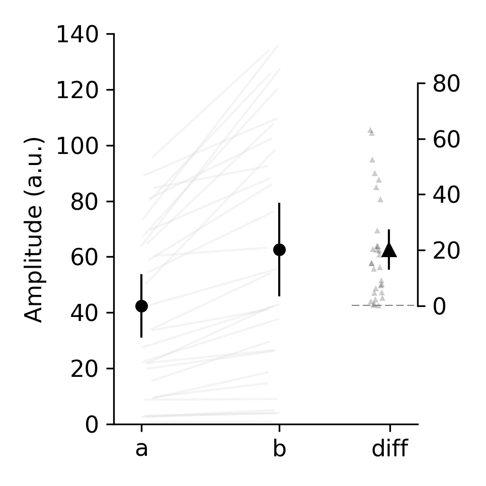
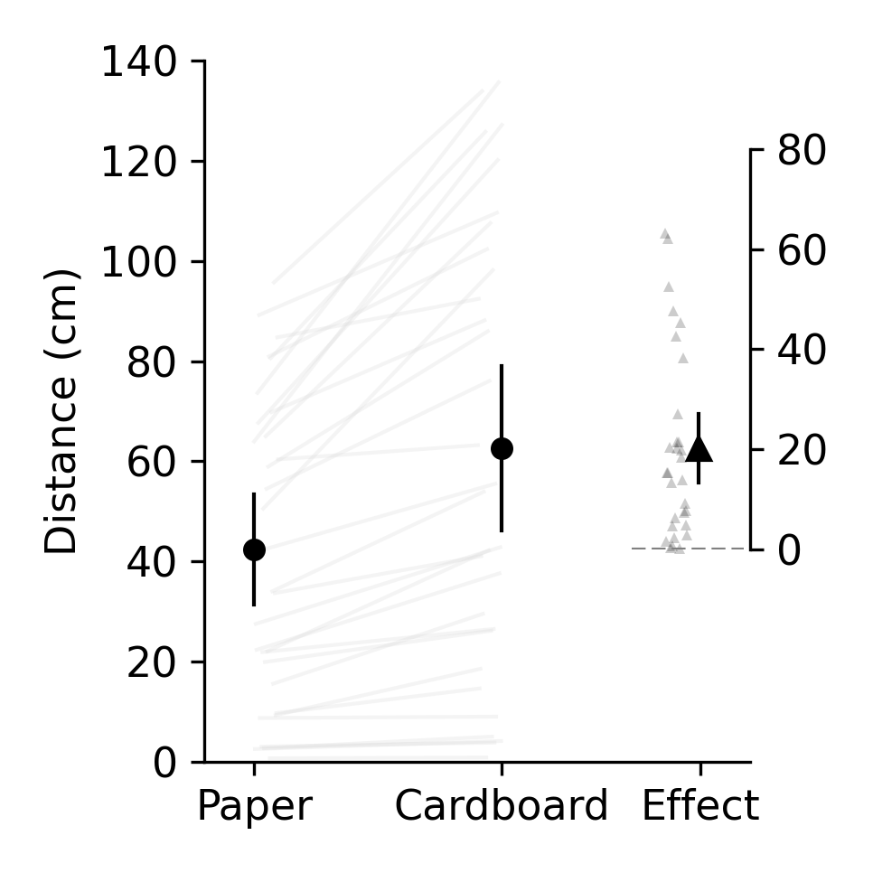
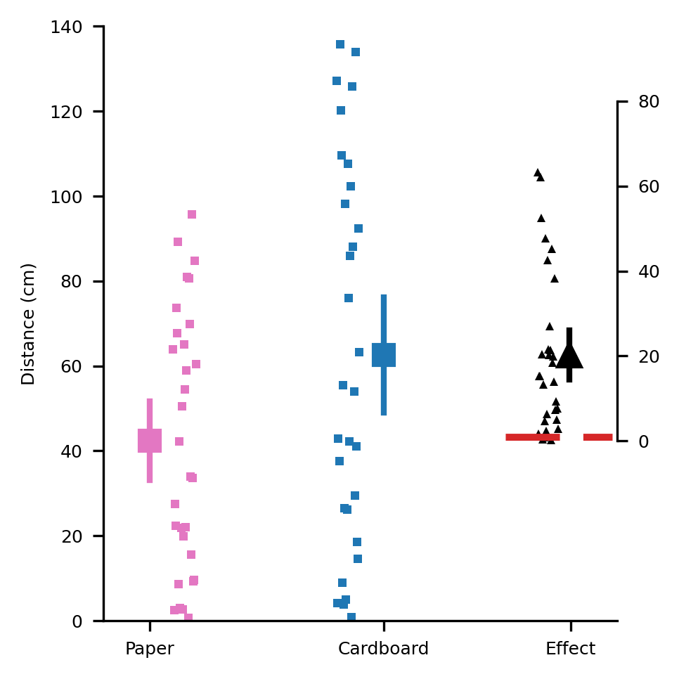

Tutorial
========

This tutorial will get you up and running with **pliffy** in 5 min.

Part 1. Import pliffy, generate simulated data and prepare plot info
--------------------------------------------------------------------
With the virtual environment you created during the :ref:`installation` activated, start Python and type the following:

.. code-block:: python

    >>> from pliffy import PliffyInfoABD, plot_abd
    >>> import random
    >>> random.seed(42)
    >>> data = [random.random() * 100 for _ in range(60)]
    >>> data_a = data[:30]
    >>> data_b = data[30:]
    >>> info = PliffyInfoABD(data_a=data_a, data_b=data_b)

The above code imports the two key elements that we need from **pliffy** and the `random` module. We then generate random data and assign it to the `data_a` and `data_b` parameters of the PliffyInfoABD object.

Part 2. Generate pliffy plot for independent observations
---------------------------------------------------------
To generate our **pliffy** plot, we simply have to pass `info` to `plot_abd`.

.. code-block:: python

    >>> plot_abd(info)

The above figure is the default **pliffy** style. It assumes that `data_a` and `data_b` are independent and the confidence intervals are all 95%.

**pliffy** also prints the results to our Python console:

.. code-block:: Python

    --------------------------------------------------------------
    outcome                 mean              95% CI
    --------------------------------------------------------------
    a                       42.63          32.17 to 56.72
    b                       61.94          54.33 to 79.93
    diff                    20.26          16.02 to 26.87
    --------------------------------------------------------------

What if our data was paired?

Part 3. Generate pliffy plot for dependent (paired) observations
----------------------------------------------------------------
First we will create a new version of `data_b` that is dependent or related to `data_a`. Then we will specify that the data are paired by specifying a `design` parameter.

.. code-block:: python

    >>> data_b = [val * (random.random()+1) for val in data_a]
    >>> info = PliffyInfoABD(data_a=data_a, data_b = data_b, design="paired")
    >>> plot_abd(info)

Great, but the data actual reflect the distance ants can walk in 30s when they are carrying a piece of paper or a piece of cardboard. Lets add these details to the x-axis and y-axis labels top make our plot more informative. To do this, we will have to import `ABD` from **pliffy**.

.. code-block:: python

    >>> from pliffy import ABD
    >>> info = PliffyInfoABD(
	        data_a=data_a,
	        data_b=data_b,
	        design='paired',
	        measure_units='Distance (cm)',
	        xtick_labels=ABD(a='Paper', b='Cardboard', diff='Effect')
            )
    >>> plot_abd(info)

Part 4. Taking full control of our pliffy plots
-----------------------------------------------
What if we want some additional control of our **pliffy** plots? While **pliffy** uses sensible defaults, we may want to change a few things. To know what we can change, we will print out an empty instance of `PliffyInfoABD`:

.. code-block:: python

    >>> PliffyInfoABD()
        PliffyInfoABD(
            data_a=None,
            data_b=None,
            ci_percentage=95,
            design='unpaired',
            measure_units='Amplitude (a.u.)',
            xtick_labels=ABD(a='a', b='b', diff='diff'),
            decimals=2,
            plot_name='figure',
            save=False,
            save_path=None,
            save_type='png',
            dpi=180,
            marker=ABD(a='o', b='o', diff='^'),
            marker_color=ABD(a='black', b='black', diff='black'),
            summary_marker_size=ABD(a=5, b=5, diff=6),
            raw_marker_size=ABD(a=3, b=3, diff=3),
            raw_marker_transparency=0.2,
            paired_data_joining_lines=True,
            paired_data_line_color='gainsboro',
            paired_line_transparency=0.3,
            paired_data_plot_raw_diff=True,
            ci_line_width=1,
            fontsize=11,
            zero_line_color='grey',
            zero_line_width=1,
            show=True,
            width_height_in_inches=(3.23, 3.23),
            )

Wow! That is a lot of options. But don't get overwhelmed. The best way to learn what these parameters do is to look them up in the reference guides (:ref:`PliffyInfoABD`). Alternatively, we can simply change some of the values and see what we get. For example:

.. code-block:: python

    >>> info = PliffyInfoABD(
            data_a=data_a,
            data_b=data_b,
            ci_percentage=90,
            design='paired',
            measure_units='Distance (cm)',
            xtick_labels=ABD(a='Paper', b='Cardboard', diff='Effect'),
            marker=ABD(a='s', b='s', diff='^'),
            marker_color=ABD(a='tab:pink', b='tab:blue', diff='black'),
            summary_marker_size=ABD(a=7, b=7, diff=8),
            raw_marker_transparency=1.0,
            paired_data_joining_lines=False,
            ci_line_width=2,
            fontsize=6,
            zero_line_color='tab:red',
            zero_line_width=2,
            )
    >>> plot_abd(info)

That is an 'interesting' looking figure. As you can see, **pliffy** is powerful. But that power can be abused and unaesthetic figures generated. You have been warned!

What next?
----------
Hopefully you were able to follow along and learned the basics of **pliffy**. You should be ready to use your own data to generate your very first **pliffy** plot.

